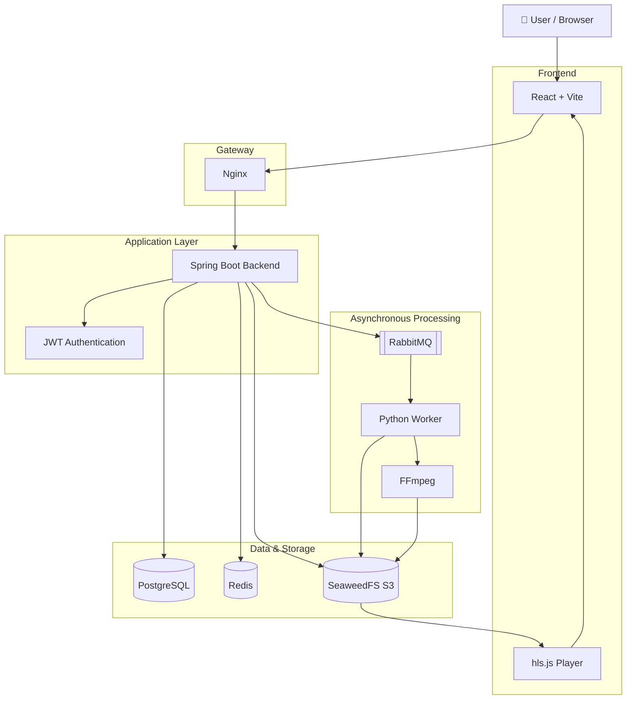
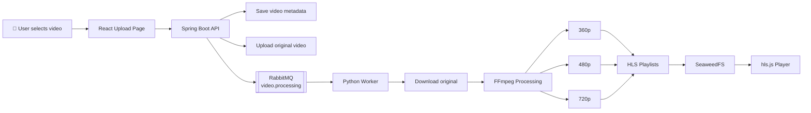
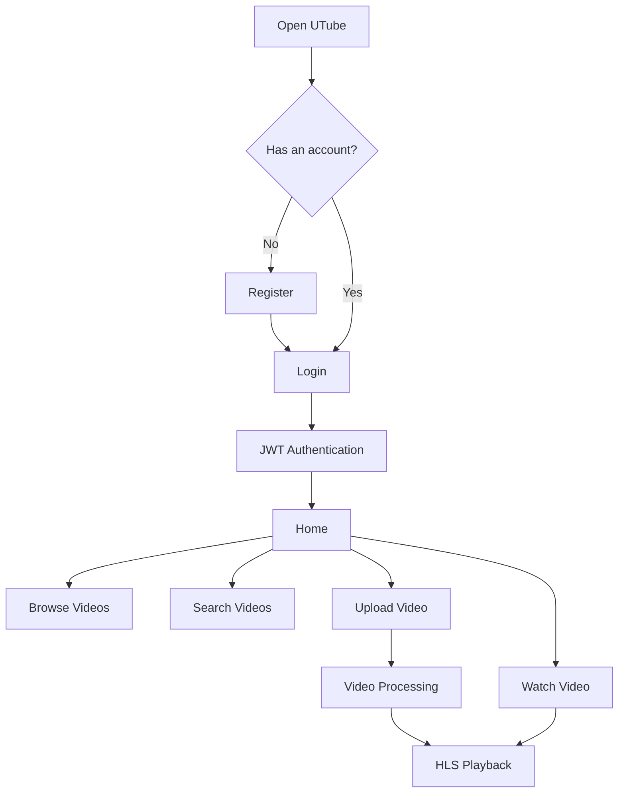
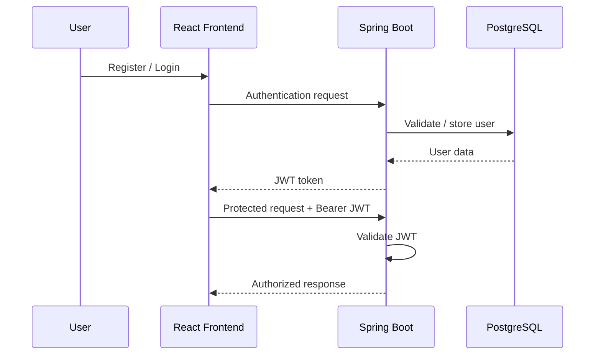

# UTube

### A Full-Stack Video Sharing and Streaming Platform

UTube is a full-stack video-sharing platform inspired by modern video streaming applications. It supports user authentication, video uploads, asynchronous video processing, HLS-based adaptive streaming, video browsing, search, and persistent storage.

The system combines a React frontend, Spring Boot backend, PostgreSQL database, Redis caching, RabbitMQ-based asynchronous processing, SeaweedFS object storage, and a Python + FFmpeg video-processing worker.

---

## ✨ Features

- User registration and login
- JWT-based authentication
- Video upload with title and description
- Persistent video metadata
- Object-based video storage
- Asynchronous video processing
- Automatic thumbnail generation
- FFmpeg-based video transcoding
- HLS streaming
- Multiple video resolutions:
  - 360p
  - 480p
  - 720p
- Video browsing and search
- Responsive React-based interface
- Dockerized infrastructure
- Nginx reverse proxy
- RabbitMQ-based processing pipeline

---

## 🛠️ Technology Stack

| Layer | Technology |
|---|---|
| Frontend | React + Vite |
| Backend | Spring Boot + Java 21 |
| Authentication | JWT |
| Database | PostgreSQL |
| Cache | Redis |
| Message Queue | RabbitMQ |
| Object Storage | SeaweedFS S3 |
| Video Processing | Python + FFmpeg |
| Streaming | HLS + hls.js |
| Reverse Proxy | Nginx |
| Containerization | Docker + Docker Compose |
| Version Control | Git + GitHub |

---

# 🏗️ System Architecture



### Architecture Overview

1. The user interacts with the React frontend.
2. Nginx acts as the gateway between the frontend and backend services.
3. Spring Boot handles authentication, APIs, business logic, and video metadata.
4. PostgreSQL stores application data.
5. Redis provides caching support.
6. SeaweedFS stores uploaded videos, processed HLS files, and thumbnails.
7. RabbitMQ sends video-processing jobs to the worker asynchronously.
8. The Python worker downloads videos and uses FFmpeg to generate multiple resolutions and HLS playlists.
9. The processed HLS files are stored back in SeaweedFS.
10. The frontend uses hls.js for video playback.

---

# 🎬 Video Upload & Processing Flow



### Processing Pipeline

```text
Upload
   ↓
Spring Boot
   ↓
SeaweedFS
   ↓
RabbitMQ
   ↓
Python Worker
   ↓
FFmpeg
   ↓
360p / 480p / 720p
   ↓
HLS
   ↓
SeaweedFS
   ↓
hls.js
   ↓
Video Playback
```

---

# 👤 User Flow



---

# 🔐 Authentication Flow

UTube uses JWT-based authentication for protected backend operations.



---

# 🚀 Getting Started

## 1. Prerequisites

Install the following before running UTube:

- Git
- Docker Desktop
- Java 21
- Node.js + npm
- Python 3
- FFmpeg

Verify the installations:

```powershell
git --version
docker --version
docker compose version
java -version
node --version
npm --version
python --version
ffmpeg -version
```

---

# 📥 2. Clone the Repository

Open PowerShell:

```powershell
git clone https://github.com/Srinvitha/UTube.git
cd UTube
git switch main
```

---

# ▶️ 3. Start UTube

UTube uses four terminals.

---

## Terminal 1 — Infrastructure

From the project root:

```powershell
docker compose -f member4-infrastructure/docker/docker-compose.yml up -d
```

Check the running containers:

```powershell
docker ps
```

The infrastructure includes:

- PostgreSQL
- Redis
- RabbitMQ
- SeaweedFS
- Nginx

---

## Terminal 2 — Spring Boot Backend

Open a new PowerShell terminal:

```powershell
cd UTube\backend
```

Start the backend:

```powershell
.\mvnw.cmd spring-boot:run "-Dspring-boot.run.jvmArguments=-Dutube.storage.access-key=utube -Dutube.storage.secret-key=change_me -Dutube.storage.endpoint=http://localhost:8333"
```

The backend runs on:

```text
http://localhost:8080
```

Wait until Spring Boot reports that the application has started.

---

## Terminal 3 — Video Processing Worker

Open another PowerShell terminal:

```powershell
cd UTube\video-worker
```

### First time only

Install Python dependencies:

```powershell
pip install -r requirements.txt
```

Set the required environment variables:

```powershell
$env:RABBITMQ_HOST="localhost"
$env:RABBITMQ_PORT="5672"
$env:RABBITMQ_USER="utube"
$env:RABBITMQ_PASSWORD="change_me"

$env:S3_ENDPOINT="http://localhost:8333"
$env:S3_ACCESS_KEY="utube"
$env:S3_SECRET_KEY="change_me"
```

Start the worker:

```powershell
python main.py
```

You should see:

```text
===================================
          UTube VIDEO WORKER
===================================
RabbitMQ: localhost:5672
Queue: video.processing
Waiting for video processing jobs...
===================================
```

The worker remains running and waits for video-processing jobs from RabbitMQ.

---

## Terminal 4 — React Frontend

Open another PowerShell terminal:

```powershell
cd UTube\Frontend
```

### First time only

Install frontend dependencies:

```powershell
npm install
```

Start the development server:

```powershell
npm run dev
```

Open:

```text
http://localhost:5173/
```

---

# 🔁 Running UTube Again

After the project has already been installed, you do **not** need to reinstall dependencies every time.

### Terminal 1

```powershell
cd UTube
docker compose -f member4-infrastructure/docker/docker-compose.yml up -d
```

### Terminal 2

```powershell
cd UTube\backend

.\mvnw.cmd spring-boot:run "-Dspring-boot.run.jvmArguments=-Dutube.storage.access-key=utube -Dutube.storage.secret-key=change_me -Dutube.storage.endpoint=http://localhost:8333"
```

### Terminal 3

```powershell
cd UTube\video-worker

$env:RABBITMQ_HOST="localhost"
$env:RABBITMQ_PORT="5672"
$env:RABBITMQ_USER="utube"
$env:RABBITMQ_PASSWORD="change_me"

$env:S3_ENDPOINT="http://localhost:8333"
$env:S3_ACCESS_KEY="utube"
$env:S3_SECRET_KEY="change_me"

python main.py
```

### Terminal 4

```powershell
cd UTube\Frontend
npm run dev
```

Then open:

```text
http://localhost:5173/
```

---

# 🌐 Service URLs

| Service | URL |
|---|---|
| UTube Frontend | http://localhost:5173 |
| Spring Boot Backend | http://localhost:8080 |
| Nginx | http://localhost |
| Nginx Health Check | http://localhost/health |
| SeaweedFS S3 | http://localhost:8333 |
| RabbitMQ Management | http://localhost:15672 |
| PostgreSQL | localhost:5432 |
| Redis | localhost:6379 |

---

# 🧪 Using UTube

### 1. Register

Create a new UTube account using the registration page.

### 2. Login

Sign in using your registered credentials.

### 3. Browse

Explore available videos from the home page.

### 4. Search

Use the search functionality to find videos.

### 5. Watch

Open a video to access the video player and HLS stream.

### 6. Upload

Authenticated users can upload a video with:

- Title
- Description
- Video file
- Optional thumbnail

The uploaded video enters the asynchronous processing pipeline.

---

# 📦 Storage Structure

UTube organizes objects in SeaweedFS using separate logical buckets.

### Original Videos

```text
originals/<videoId>/<filename>
```

### Processed Videos

```text
processed/<videoId>/master.m3u8
processed/<videoId>/360p/index.m3u8
processed/<videoId>/480p/index.m3u8
processed/<videoId>/720p/index.m3u8
```

### Thumbnails

```text
thumbnails/<videoId>/thumbnail.jpg
```

---

# 📨 RabbitMQ Queues

UTube uses RabbitMQ for asynchronous video processing.

| Queue | Purpose |
|---|---|
| `video.processing` | Sends video-processing jobs to the worker |
| `video.completed` | Reports successful processing |
| `video.failed` | Reports processing failures |

This keeps video processing separate from the main backend request flow.

---

# 🐳 Docker Infrastructure

The infrastructure services are managed using Docker Compose.

Start:

```powershell
docker compose -f member4-infrastructure/docker/docker-compose.yml up -d
```

Stop:

```powershell
docker compose -f member4-infrastructure/docker/docker-compose.yml down
```

Check containers:

```powershell
docker ps
```

---

# 🔧 Troubleshooting

## Docker services are not running

Check:

```powershell
docker ps
```

If required services are missing:

```powershell
docker compose -f member4-infrastructure/docker/docker-compose.yml up -d
```

---

## Check PostgreSQL

```powershell
docker exec utube-postgres pg_isready
```

---

## Check Redis

```powershell
docker exec utube-redis redis-cli ping
```

Expected:

```text
PONG
```

---

## Check RabbitMQ

```powershell
docker exec utube-rabbitmq rabbitmq-diagnostics -q ping
```

---

## Frontend dependencies are missing

From `Frontend`:

```powershell
npm install
```

Then:

```powershell
npm run dev
```

---

## Python dependencies are missing

From `video-worker`:

```powershell
pip install -r requirements.txt
```

Then:

```powershell
python main.py
```

---

## Worker says "Waiting for video processing jobs"

This means the worker is running successfully and is waiting for a message from RabbitMQ.

```text
Waiting for video processing jobs...
```

Leave the worker terminal running while using UTube.

---

# 🛑 Stopping UTube

Stop the frontend with:

```text
Ctrl + C
```

Stop the worker with:

```text
Ctrl + C
```

Stop the Spring Boot backend with:

```text
Ctrl + C
```

Finally, stop the Docker infrastructure:

```powershell
docker compose -f member4-infrastructure/docker/docker-compose.yml down
```

---

# 🎓 Key Learning Outcomes

Through this project, we learned how to build a distributed full-stack application by integrating frontend development, REST APIs, JWT authentication, databases, object storage, message queues, asynchronous processing, Docker, and HLS-based video streaming.

We also gained practical experience in connecting multiple independent services into a complete video-processing pipeline.

---

# 👥 Project

**UTube — Full-Stack Video Sharing & Streaming Platform**

Built using:

**React • Spring Boot • PostgreSQL • Redis • RabbitMQ • SeaweedFS • Python • FFmpeg • HLS • Nginx • Docker**